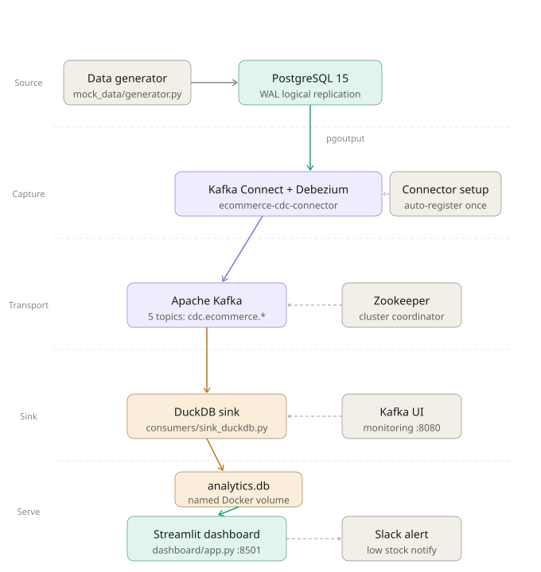
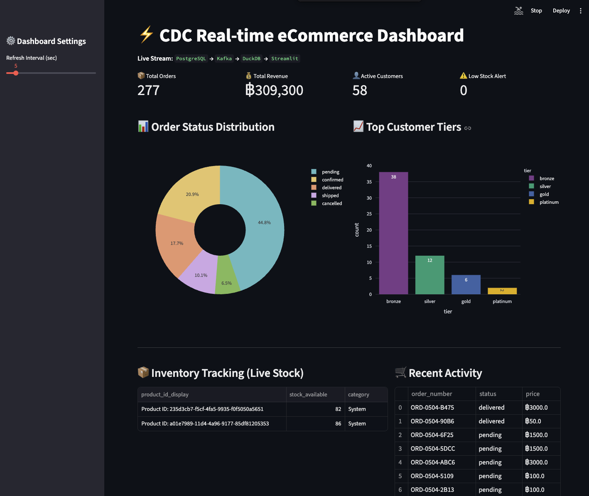

# ⚡ CDC Real-time eCommerce Pipeline

> **Real-time data pipeline** ที่จำลองระบบ eCommerce โดยใช้ Change Data Capture (CDC) ในการ stream ข้อมูลจาก PostgreSQL → Kafka → DuckDB และแสดงผลผ่าน Streamlit Dashboard แบบ real-time

---

## 📌 Table of Contents
- [About](#about)
- [Architecture](#architecture)
- [Tech Stack](#tech-stack)
- [Database Schema](#database-schema)
- [Quick Start](#quick-start)
- [Screenshots](#screenshots)

---

## About

โปรเจคนี้สร้าง end-to-end data pipeline ที่จำลองการทำงานของระบบ eCommerce จริง โดยมี Data Generator สร้างข้อมูล transaction อัตโนมัติ (orders, customers, inventory) และใช้ CDC เพื่อ capture ทุก insert/update/delete จาก database แบบ real-time โดยไม่กระทบ production database

**สิ่งที่ระบบทำได้:**
- Stream ข้อมูล database changes แบบ real-time ผ่าน Kafka
- Sync ข้อมูลเข้า DuckDB Analytical Database อัตโนมัติ
- แสดงผล KPI, Charts และ Live Inventory บน Dashboard
- ส่ง Slack Alert เมื่อสินค้าใกล้หมดสต็อก
- รันทุกอย่างด้วย `docker compose up` คำสั่งเดียว

---

## Architecture



---

## Tech Stack

### Source Layer
| Tool | Version | เหตุผลที่เลือก |
|------|---------|----------------|
| **PostgreSQL** | 15 | รองรับ Logical Replication (WAL) ซึ่งจำเป็นสำหรับ CDC, production-grade OLTP database |

### CDC & Streaming Layer
| Tool | Version | เหตุผลที่เลือก |
|------|---------|----------------|
| **Debezium** | 2.4.2 | CDC connector ที่ popular ที่สุด, รองรับ PostgreSQL pgoutput plugin, ให้ before/after image ของทุก row change |
| **Apache Kafka** | 7.5.0 | Distributed message broker ที่ scalable, รองรับ replay และ consumer group, industry standard สำหรับ streaming |
| **Kafka Connect** | 7.5.0 | Framework สำหรับ run Debezium connector โดยไม่ต้องเขียน code เอง |

### Sink & Analytics Layer
| Tool | Version | เหตุผลที่เลือก |
|------|---------|----------------|
| **DuckDB** | 1.4.4 | In-process OLAP database ที่เร็วมากสำหรับ analytical queries, ไม่ต้องมี server แยก, เหมาะกับ dashboard ขนาดกลาง |
| **Python (confluent-kafka)** | - | Consumer ที่ reliable กว่า kafka-python, รองรับ librdkafka |

### Dasboard Layer
| Tool | Version | เหตุผลที่เลือก |
|------|---------|----------------|
| **Streamlit** | 1.50.0 | สร้าง data dashboard ได้เร็วด้วย Python ล้วน, มี auto-refresh built-in |
| **Plotly** | 6.7.0 | Interactive charts ที่สวยงาม, รองรับ pie, bar, line chart |

### Infrastructure
| Tool | เหตุผลที่เลือก |
|------|----------------|
| **Docker Compose** | รัน environment ทั้งหมดด้วยคำสั่งเดียว, reproducible, ไม่ต้อง install dependencies บนเครื่อง |

---

## Database Schema

```sql
ecommerce/
├── customers       # ข้อมูลลูกค้า
│   ├── id          (UUID, PK)
│   ├── first_name, last_name
│   ├── email       (UNIQUE)
│   ├── tier        (bronze/silver/gold/platinum)
│   ├── total_spent (NUMERIC)
│   └── is_active   (BOOLEAN)
│
├── products        # สินค้า
│   ├── id          (UUID, PK)
│   ├── sku         (UNIQUE)
│   ├── name, category
│   ├── price, cost (NUMERIC)
│   └── is_available (BOOLEAN)
│
├── orders          # คำสั่งซื้อ
│   ├── id          (UUID, PK)
│   ├── order_number (UNIQUE)
│   ├── customer_id (FK → customers)
│   ├── status      (pending/confirmed/shipped/delivered/cancelled)
│   └── total       (NUMERIC)
│
├── inventory       # สต็อกสินค้า
│   ├── id          (UUID, PK)
│   ├── product_id  (FK → products)
│   ├── quantity    (total stock)
│   └── available   (available stock)
│
└── cdc_heartbeat   # ใช้สำหรับ keep Debezium alive
```

**DuckDB Analytics (analytics.db)** — Mirror ของทุกตารางข้างต้น sync แบบ real-time ผ่าน Kafka

---

## Quick Start

### Prerequisites
- Docker & Docker Compose
- Python 3.9+

### 1. Clone และตั้งค่า

```bash
git clone https://github.com/Meuracha/cdc-pipeline.git
cd cdc-pipeline

# สร้าง .env และเพิ่ม environment ที่ต้องใช้
```

### 2. รัน Pipeline

```bash
docker compose up -d
```

ระบบจะ start ตามลำดับอัตโนมัติ:
1. PostgreSQL → สร้าง schema และ seed data
2. Zookeeper + Kafka → Message broker พร้อมใช้
3. Kafka Connect + Debezium → ติดตั้ง CDC connector
4. `connector-setup` → Register Debezium connector อัตโนมัติ
5. `data-generator` → เริ่ม generate mock transactions
6. `sink-duckdb` → เริ่ม consume และ sync ข้อมูลเข้า DuckDB
7. Streamlit Dashboard → พร้อมแสดงผล

### 3. เปิด Dashboard

| Service | URL |
|---------|-----|
| 📊 Streamlit Dashboard | http://localhost:8501 |
| 🔍 Kafka UI | http://localhost:8080 |
| 🔌 Kafka Connect API | http://localhost:8083 |

### 4. ตรวจสอบ Pipeline

```bash
# ดูว่า data sync เข้า DuckDB แล้วไหม
docker logs sink_duckdb --tail=20

# เช็ค connector status
curl http://localhost:8083/connectors/ecommerce-cdc-connector/status

# ดู Kafka topics
docker logs kafka-ui-cdc
```

### 5. หยุดระบบ

```bash
docker compose down        # หยุดแต่เก็บ data ไว้
docker compose down -v     # หยุดและลบ data ทั้งหมด
```

---

## Screenshots

### KPI metrics, order distribution chart



## Project Structure

```
cdc-pipeline/
├── connector/
│   ├── register.py           # Debezium connector config
│   └── wait_and_register.py  # Auto-register on startup
├── consumers/
│   ├── Dockerfile
│   ├── requirements.txt
│   └── sink_duckdb.py        # Kafka consumer → DuckDB
├── dashboard/
│   ├── app.py                # Streamlit dashboard
│   └── notifications.py      # Slack alert
├── init-db/
│   └── 01_schema.sql         # PostgreSQL schema + seed
├── mock_data/
│   └── generator.py          # Mock transaction generator
├── .env
├── .gitignore
├── docker-compose.yml
└── README.md
```

---